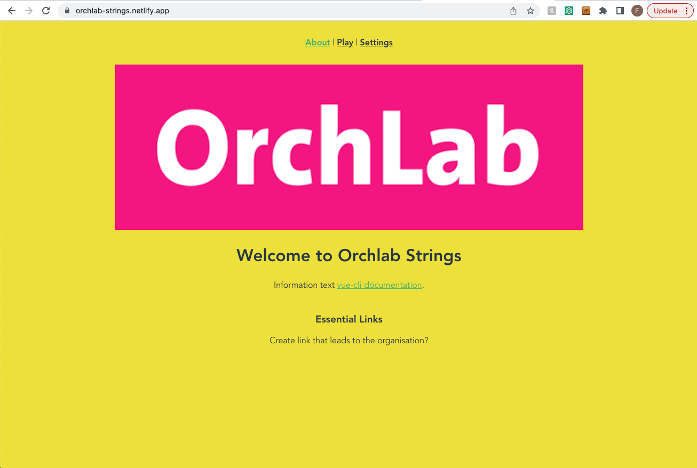
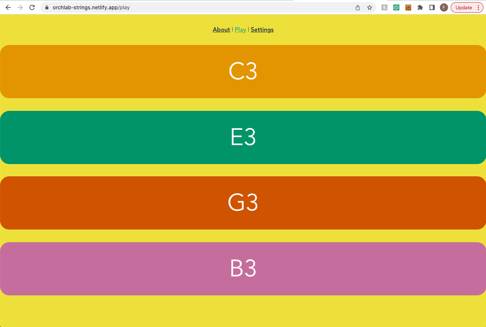
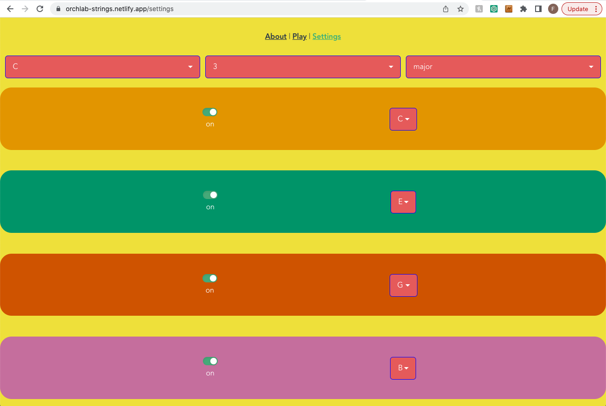

# Orchlab Strings

## Introduction
In association/partnership with [London Philharmonic Orchestra](https://lpo.org.uk/) and []()<- insert name, 

## About the app

The app is live on [Netlify](https://orchlab-strings.netlify.app/) and can be used on desktop as well as mobile devices. 

<details>
<summary>Playing</summary>
<br> 
To play use the keyboard keys (INSERT KEYS HERE) and the mouse

<br>
</details>

<details>
<summary>Project setup</summary>
<br>
  ```
npm install
```

### Compiles and hot-reloads for development
```
npm run serve
```

### Compiles and minifies for production
```
npm run build
```

### Lints and fixes files
```
npm run lint
```

### Customize configuration
See [Configuration Reference](https://cli.vuejs.org/config/).


### Sounds

This project uses sounds from https://freesound.org/people/MTG/ and the following is the text from their samples. 

Recorded in the context of the good-sounds.org project from the Music Technology Group, Universitat Pompeu Fabra, Barcelona.
Part of the Good-sounds dataset of monophonic instrumental sounds.

It has also used this sound https://freesound.org/people/smoseson/sounds/48024/

And this one https://freesound.org/people/tim.kahn/packs/2680/

http://mta.me/ has an example of crediting
</details>

<details>
<summary>Demo</summary>

## Home page


## Play page


## Settings page


</details>

## Contributors
- [Gawain Hewitt](https://gawainhewitt.co.uk/||https://www.linkedin.com/in/gawainhewitt/||https://github.com/gawainhewitt)
- [Farzan Imanzadeh](https://www.linkedin.com/in/farzan-imanzadeh-079a95a3/||https://github.com/Farzan-I)
